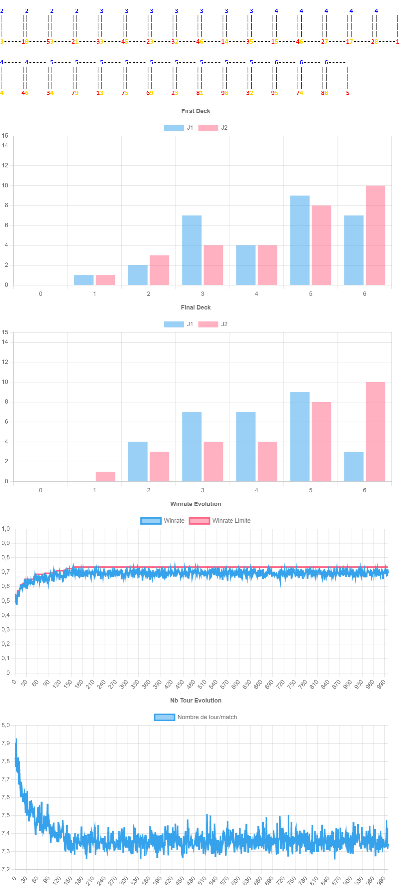

# Optimisation

## Stack technique

Concernant la stack technique, j'ai voulu partir sur un langage et une technologie que je connaissais. Je suis donc parti sur du *TypeScript*, un dérivé du *JavaScript* reprenant le typage fort des langages comme le C#. Pour le faire fonctionner sur navigateur, il faut le transpiller en JavaScript classique, j'ai donc utilisé la bibliothèque/boilerplate *Vite* qui inclut un serveur de développement, et un moyen de transpiler pour la production.

Pour l'affichage des graphs, j'ai utilisés la bibliothèque Chart.js qui permet de faire un affichage de données très simple et efficace.

## Organisation du code

Le code est organisé de la manière suivante:

- Le fichier `Params.ts` contient des paramètres modifiables de la génération (nombre de générations, cout des différents types de cartes...)
- Le fichier `main.ts` contient le code effectif de la génération
- Les fichiers `Battle.ts`, `Card.ts` et `Player.ts` contiennent les classes représentant les différents objets du jeu
- `IDamageable` contient une interface qui représente tous les objets pouvant prendre des dégâts (a de la vie, peut prendre des dégâts)

## Entrainement sur 1000 générations

Si on lance une série de 1000 générations, avec à chaque fois 1000 parties, et sans capacités spéciales, on obtient les résultats suivants:

On remarque bien une évolution entre le deck de début de génération et de fin de génération, avec une plus grande répartition de cartes avec un cout de 6 au début (du à leur plus grand nombre dans la setlist de base), et une grosse représentation de carte à 3 à la fin, au détriment des cartes à 6.
Les cartes à 6 sont des cartes dites "de kill", qui une fois jouées tuent rapidement l'adversaire.

On remarque également que l'algorithme de Montecarlo faut évoluer les cartes de moins en moins en fonction de la génération, mais que le nombre de tour lui diminue de plus en plus.

### Activation des pouvoirs

On ajoute maintenant le pouvoir Taunt (ou provocation).

On remarque immédiatement une augmentation significative du nombre de tour moyen par partie. En effet, Taunt va demander aux cartes de d'abord attaquer les autres cartes plutôt que le joueur, ce qui va ralentir le jeu. Le winrate augmente aussi légèrement. Les cartes avec Taunt qui sont favorisées sont celles ne comprenant pas forcément beaucoup d'attaque mais beaucoup de vie, qui vont permettre de tranker plus longtemps les dégâts infligés par les adversaires.

En augmentant son cout (passage de 0 à 2 de mana), on remarque un moins grand nombre de carte provocations, et surtout un décalage vers les couts plus grand.

On remarque dont bien que Montecarlo va choisir des cartes qui lui sont avantageuse au fur et à mesure des générations. 

- Sans Taunt on élimine les cartes trop chers et qui n'ont aucun intérêt (6 de mana avec beaucoup de vie mais peu d'attaque)
- Avec un Taunt à 0 de mana, on remarque une apparition un peu générale dans toutes les cartes, en priorisant la vie plutôt que les dégâts pour les grosses cartes.
- Avec un Taunt à 2 de mana il y a beaucoup de cartes avec provocation, mais plus des cartes avec un fort coup, permettant de bloquer longtemps les attaques

### Ajout d'autres pouvoirs

On ajoute maintenant les pouvoirs Trample et Distortion à 1 de mana chacun.

Maintenant, il n'y a presque plus de cartes avec un coup faible et sans capacités. Les couts des cartes se regroupent à nouveau autour de 3 et de 4 (qu'on peut donc jouer rapidement vers le premier tour). Le nombre de tour se réduit aussi énormément, ce qui s'explique par par Trample, qui fait des dégâts au joueur en plus des cartes.

Encore une fois Montecarlo a fait évoluer les cartes ayant un impacte négatif sur la victoire, ou n'ayant au moins pas un impact positif. Les cartes sans pouvoirs sont supprimés, puisque avec 3 de mana, on peu rarement jouer plus d'une carte par tour, mais on peut rapidement dans la partie jouer des cartes avec un cout plus élevé. Il n'y a donc peu d'intérêt d'avoir des cartes avec un cout de 0, 1 ou 2. Les cartes à 6 arrivent elles trop tard dans la partie, mais peuvent être un vrai renversement avec de gros dégâts.

### Condition finales

On applique maintenant les paramètres définitif du jeu. Mana de départ à 0, 40 cartes dans le deck, 30 PV et les mêmes couts que précédemment.

Avec un mana commençant à 0, on remarque la réapparition des cartes de cout plus faible, et toujours la disparition des cartes trop chères, qui vont mettre du temps avant d'avoir un impacte sur le jeu, au risque de se faire tuer avant. La durée des parties augmente légèrement par rapport à avant, à cause des tours de début de partie qui ne permettent pas forcément de jouer des cartes.

## Entrainement avec suppression des cartes négatives

Maintenant, on va générer 10 decks différents avec 1000 générations. Ces 10 decks seront entrainés face à 10 deck de référence différents. Cette méthode va permettre d'éviter les effets de biais qu'on pourrait avoir en s'entrainant contre un seul deck, comme un deck trop fort qui bloque l'évolution, ou juste l'aléatoire qui n'aide pas.

Durant ces 10 decks et 10 000 générations, on va noter quelles cartes ont un impacte négatif sur la victoire. Soit en augmentant le winrate quand elles sont retirées, soit en le diminuant quand elles sont ajoutées. On va ensuite supprimer ces cartes de la liste des cartes possibles, vous éviter ainsi de générer des cartes qui ne permettent pas la victoire et accélérer l'entrainement.

On remarque une encore meilleure répartition après quelques entrainements et suppression de cartes inutiles. Plus de 550 cartes ont été éliminés parce que supprimés très souvent.

## Conclusion

J'ai donc remarqué que même avec un algorithme plutôt simple comme celui de Montecarlo, on peut faire de l'optimisation en fonction de règles établie et un critère d'évolution précis (ici le winrate). Certaines méthodes d'évolution permettent d'accélérer, comme enregistrer quels sont les facteurs de dégradation du critère d'évaluation.

Le seul problème est le nombre de générations et de répétitions qu'il faut mettre en place pour arriver à un bon résultat. Mais sa facilité d'utilisation permet de vraiment éviter des manques d'équilibrage ou les features jamais utilisées qui devraient être supprimées.

Montecarlo peut être utilisé avant la sortie d'un jeu, et utiliser le même genre d'analyses après la sortie d'un jeu mais avec les données réelles enregistrés auprès des utilisateurs.
